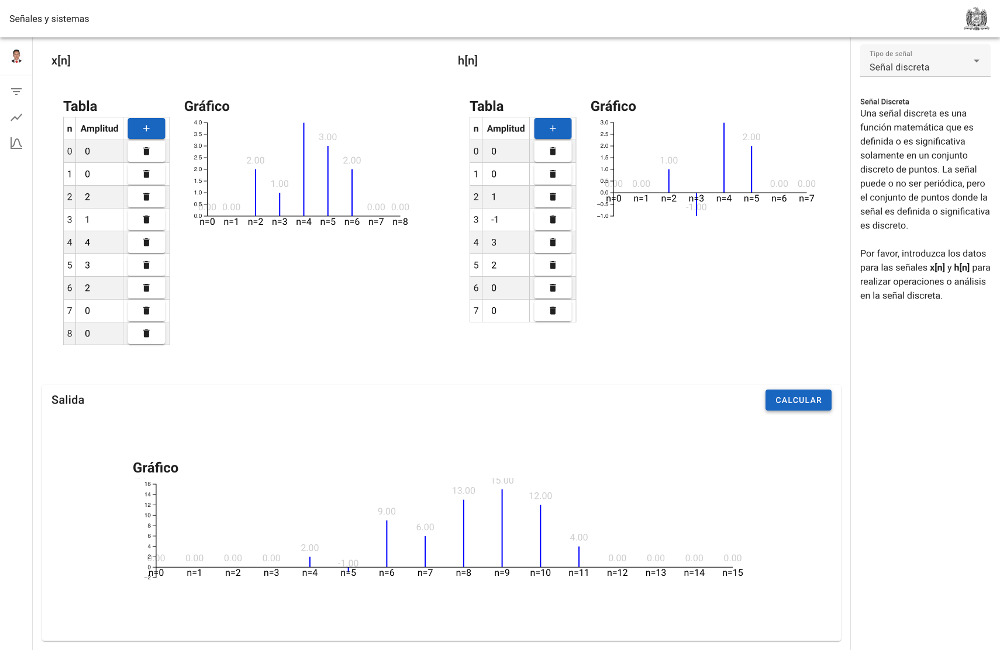

# UAZ SEÑALES Y SISTEMAS

Plataforma en línea para el cálculo y visualización de operaciones matemáticas avanzadas relacionadas con las señales y sistemas. Ya sea que seas un estudiante, un ingeniero o simplemente un entusiasta, estamos aquí para ayudarte a entender y calcular con precisión.

🌀 Convolución: Introduce tus funciones y visualiza el resultado de su convolución, un proceso que describe cómo se modifica una función por otra función.

🌌 Transformada de Fourier: Convierte tus señales del dominio del tiempo al dominio de la frecuencia y descubre los componentes de frecuencia que componen tus señales.

🎶 Series de Fourier: Descompón tus señales periódicas en una suma infinita de senos y cosenos, permitiéndote analizar y reconstruir señales desde sus componentes básicos.




## Información General

- **URL del proyecto:** [Click aquí](https://sistemas-senales-uaz-production.up.railway.app/)
- **Autor:** Holman Sneyder Cabezas Mondragon
- **Materia:** Maestria en ciencias del procesamiento de la informacion
- **Universidad:** UAZ

## Comenzando

Estas instrucciones te permitirán obtener una copia del proyecto en tu máquina local para propósitos de desarrollo y pruebas.

### Prerequisitos

- Python (versión especificada)
- Node.js y NPM

### Instalación de Dependencias

1. **Python:**
   ```bash
   pip install -r requirements.txt